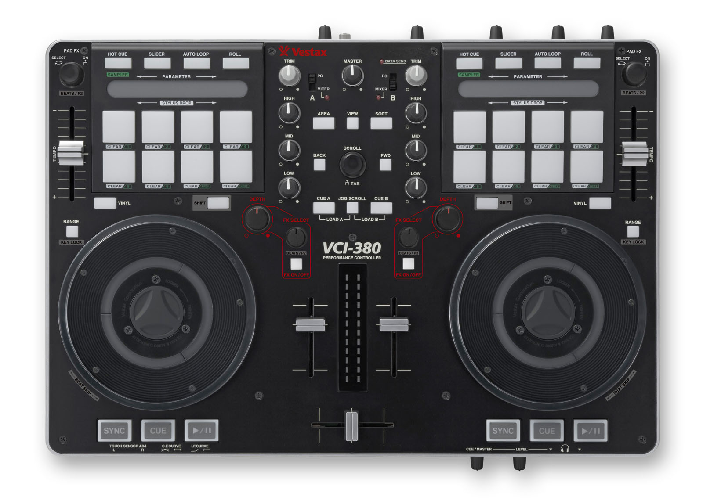

Vestax VCI-380
==============

The Vestax VCI-380 is a 2-deck controller with integrated audio interface and stand-alone mixer.
It requires its own external barrel plug power adapter.

Outputs: Balanced XLR and RCA output, and both 3.5 and 6.35mm headphone jacks.

Inputs: 2 microphones, and RCA inputs with line/phono switch.

The output will refuse to work at any other sample rate than 48kHz, so there's an option to automatically set Mixxx output sample rate to 48kHz when using the mapping. Open :menuselection:`Preferences --> Controllers --> Vestax VCI-380 --> Mapping settings` and enable :guilabel:`Automatically set sample rate to 48000 Hz`.

As Vestax went out of business in 2014, there is no support for this hardware anymore. But as it is class compliant, no driver should be needed.

   Vestax VCI-380 (top view)
   Image (c) Vestax

Useful links
------------

- `Wikipedia page about the defunct Vestax company <https://en.wikipedia.org/wiki/Vestax>`__
- `Archive of the product page <https://web.archive.org/web/http://www.vestax.com/v/products/detail.php?cate_id=189>`__
- `Mapping source and details on GitHub <https://github.com/jaymanu79/Vestax_VCI-380_Mixxx_Mapping>`__
- `Forum thread <https://mixxx.discourse.group/t/vestax-vci-380-mapping/14713>`__
- `Pull request for inclusion in Mixxx <https://github.com/mixxxdj/mixxx/pull/17089>`__
- `Old Mixxx wiki page <https://github.com/mixxxdj/mixxx/wiki/vestax_vci-380>`__

Audio Setup
-----------

The audio interface is set up in :menuselection:`Preferences --> Sound Hardware --> Output`.

========== ============== =============
Output     Device         Channel
========== ============== =============
Main       VESTAX VCI-380 Channel 1 - 2
Headphones VESTAX VCI-380 Channel 3 - 4
========== ============== =============

Inputs - RCA (line/phono) and MIC - can be handled by the integrated mixer, so they don't need to be set up in Mixxx.

Mapping
-------

Mixer functions
~~~~~~~~~~~~~~~

Main knobs and sliders work straightforwardly.

Volume sliders, crossfader and :hwlabel:`DEPTH` have soft takeover enabled. The headphone cue buttons (:hwlabel:`CUE A` / :hwlabel:`CUE B`) toggle the headphone cue (PFL). The toggle is handled by the controller itself, and Mixxx follows its state.

Hold :hwlabel:`SHIFT` while turning EQ knobs (:hwlabel:`HIGH`/:hwlabel:`MID`/:hwlabel:`LOW`) for EQ kill mode: turning the EQ to the left side cuts the frequency range, turning to the right side re-enables it (all or nothing).

Hold :hwlabel:`SHIFT` while moving the crossfader to control output balance.

Wheels
~~~~~~

You can turn the wheels with or without touching the sensitive metal part.
Make sure that the sensitivity is correctly set with :hwlabel:`TOUCH SENSOR ADJ` knobs on the front panel: the wheels must turn red when touched, and only then. If not, the tracks will refuse to play if Mixxx thinks that a platter is touched!

The LED rings are simulating a vinyl record spin.

====================================================== =================================
Action                                                 Effect
====================================================== =================================
Touch and turn wheels                                  scratching
Touch and turn wheels with :hwlabel:`SHIFT`            scratching at 10X speed
Turn wheels without touching                           temporary rate adjustments (jog)
Turn wheels without touching and with :hwlabel:`SHIFT` beatjump
Turn wheels with :hwlabel:`JOG SCROLL`                 library scrolling
====================================================== =================================

:hwlabel:`SYNC` / :hwlabel:`CUE` / :hwlabel:`> / ||`
~~~~~~~~~~~~~~~~~~~~~~~~~~~~~~~~~~~~~~~~~~~~~~~~~~~~

================================================== =======================================================
Key                                                Function
================================================== =======================================================
:hwlabel:`> / ||`                                  play/pause
:hwlabel:`SHIFT` + :hwlabel:`> / ||`               soft start / brake
:hwlabel:`CUE`                                     go to cue point
:hwlabel:`SHIFT` + :hwlabel:`CUE`                  set the cue point
:hwlabel:`SYNC`                                    blinks on each beat. Press to activate auto-sync.
:hwlabel:`SHIFT` + :hwlabel:`SYNC`                 adjust beatgrid position
:hwlabel:`VINYL`                                   toggle slip mode
================================================== =======================================================

"Tempo" sliders (pitch)
~~~~~~~~~~~~~~~~~~~~~~~

The sliders adjust pitch.

================================================== =================================
Action                                             Effect
================================================== =================================
:hwlabel:`SHIFT` + :hwlabel:`RANGE`                toggle keylock
:hwlabel:`RANGE`                                   toggle quantization
================================================== =================================

While the pitch is different from zero, the red PAD FX LED will light up as a reminder that the deck is pitched.

Navigation area
~~~~~~~~~~~~~~~

Library
^^^^^^^
============================================================== =================================================================
Action                                                         Effect
============================================================== =================================================================
Turn :hwlabel:`SCROLL`                                         move up/down
:hwlabel:`BACK` and :hwlabel:`FWD`                             move left/right
Turn left :hwlabel:`PAD FX`                                    move up/down (equivalent to turning SCROLL)
:hwlabel:`SHIFT` + turn left :hwlabel:`PAD FX`                 page up/down
Turn right :hwlabel:`PAD FX`                                   move left/right
:hwlabel:`SHIFT` + turn right :hwlabel:`PAD FX`                adjust waveform zoom
:hwlabel:`SHIFT` + push :hwlabel:`PAD FX`                      clone other deck
:hwlabel:`AREA` or push any :hwlabel:`PAD FX`                  default action
push :hwlabel:`SCROLL`                                         change focus zone (:hwlabel:`TAB`)
:hwlabel:`SORT`                                                sort according to active column
:hwlabel:`CUE A` / :hwlabel:`CUE B`                            toggle headphone cue (PFL) for deck A or B
:hwlabel:`JOG SCROLL` + :hwlabel:`CUE A` / :hwlabel:`CUE B`    load selected track into deck A or B
:hwlabel:`VIEW`                                                load and play selected track on preview deck. Push again to stop.
============================================================== =================================================================

End-of-track alerts
^^^^^^^^^^^^^^^^^^^

When a track is playing with less than 30 seconds remaining, the library LEDs will blink.

For deck 1: :hwlabel:`AREA` and :hwlabel:`BACK`

For deck 2: :hwlabel:`SORT` and :hwlabel:`FWD`

Quick Effects
~~~~~~~~~~~~~

For both decks:

================================================== ==============================================
Action                                             Effect
================================================== ==============================================
turn :hwlabel:`FX SELECT`                          select a quick effect preset
push :hwlabel:`FX SELECT`                          load the first quick effect preset of the list
:hwlabel:`FX ON/OFF`                               toggle quick effect ON/OFF
turn :hwlabel:`DEPTH`                              adjust the effect parameter ("superknob")
================================================== ==============================================

Performance pads and strips
~~~~~~~~~~~~~~~~~~~~~~~~~~~
Both strips are used in any mode for needle drop (quick navigate) on the preview deck.

To do a needle drop on the main decks, hold :hwlabel:`SHIFT` and touch the corresponding strip.

The pads work in different modes, according to the selection buttons on the top of the controller. The modes are not always related to the names they bear on the controller.

:hwlabel:`HOT CUE` mode: HOTCUES
^^^^^^^^^^^^^^^^^^^^^^^^^^^^^^^^
8 hot cues available, one per pad. The pads will light up when their hotcue is set.
The colors of the lights will approximate the colors defined for the hot cues.

- push a lighted pad to play the hotcue
- push a blank pad to set a new hotcue to the current position.
- push :hwlabel:`SHIFT` + lighted pad to clear a hotcue
- loop hotcues: the pad will turn green when the loop is active, push to disable loop

:hwlabel:`SLICER` mode: BEAT GRID tools
^^^^^^^^^^^^^^^^^^^^^^^^^^^^^^^^^^^^^^^
The 8 pads will illuminate in sequence following the beat grid. To reset the sequence to beat 1, push the :hwlabel:`SLICER` button again.

- Push a button of higher row: BPM tap. Tap it in rhythm to adjust the calculated BPM of the track
- Push a button of lower row: align beatgrid. Tap it to align the beatgrid bars to the current position.

:hwlabel:`AUTO LOOP`: loop mode
^^^^^^^^^^^^^^^^^^^^^^^^^^^^^^^
The green buttons on the left control loop activation.

- upper (button 1): creates or disables a loop (beatloop_activate)
- lower (button 5): reactivates existing loop (reloop_toggle)

The yellow buttons control beatloop size:

- left (button 3): halves the size
- right (button 4): doubles the size

The white buttons control the loop position:

- left (button 7): move left
- right (button 8): move right

Buttons 2 and 6 are unused.

:hwlabel:`ROLL`: Stems mode
^^^^^^^^^^^^^^^^^^^^^^^^^^^
If the loaded track has stems, the pads will light up in vertical pairs with the corresponding stem colors.
Stems 1 to 4, left to right:

- Push the lower button to mute/unmute the stem
- Hold the upper button (it will turn white) for FX control. While the button is pressed:

  - the quick effect buttons (FX Depth, FX select and FX on/off) apply to the selected stem instead of the whole track. (see: quick effects)
  - the parameter strip sets the individual volume of the selected stem

:hwlabel:`SAMPLER` mode (:hwlabel:`SHIFT` + :hwlabel:`HOT CUE`)
^^^^^^^^^^^^^^^^^^^^^^^^^^^^^^^^^^^^^^^^^^^^^^^^^^^^^^^^^^^^^^^
In Sampler mode, each pad is controlling one of the samplers.
They are mapped so the pads are organized in the same layout as the 8 samplers on Mixxx default skin.

====== ================= ==================== =============================
Color  Meaning           Pad action           :hwlabel:`SHIFT` + pad action
====== ================= ==================== =============================
dimmed no track loaded   load selected track
green  a track is loaded play                 eject
yellow playing           restart              stop
====== ================= ==================== =============================

Switching to sampler mode will automatically activate the samplers display on screen.

Customization
~~~~~~~~~~~~~

The colors used can be customized by editing the mapping JavaScript file.
Also the color pattern when no track is loaded can be modified to your liking.
